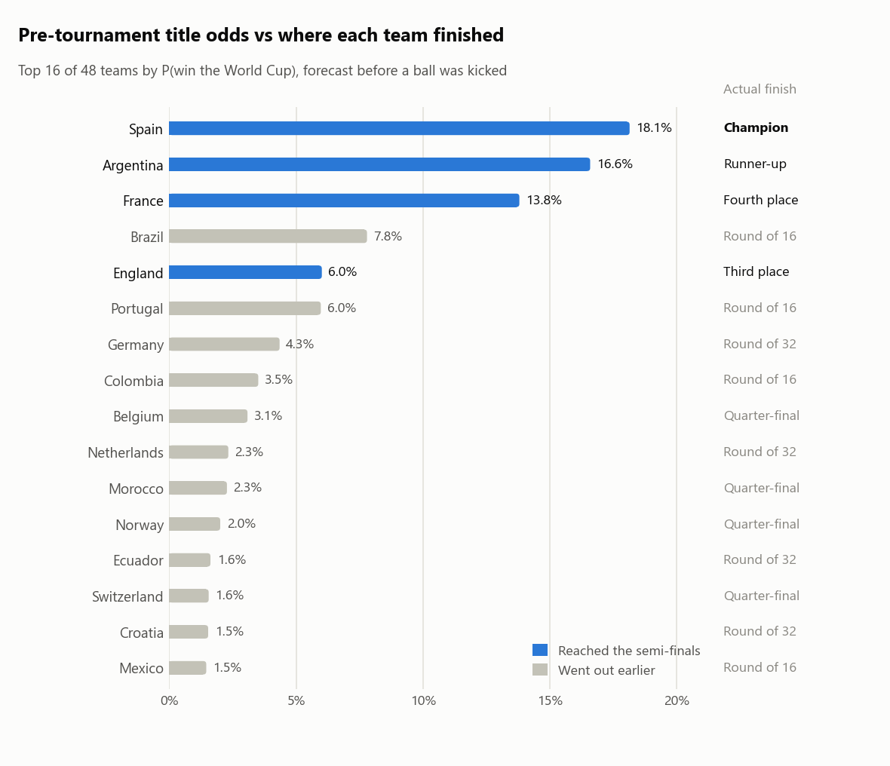

# FIFA World Cup 2026 Predictor

A reproducible, command-line **forecasting pipeline** for the 2026 FIFA World Cup. It predicts a
scoreline for every match (all 72 group games and all 32 knockout ties), a stage-by-stage probability
for all 48 teams, and, crucially, **scores its own pre-tournament forecast against what really
happened.**

The tournament is over, so this repository is now also the **record of how those forecasts did**:
all 104 results are in [`data/input/actual_results_2026.csv`](data/input/actual_results_2026.csv),
and the predicted-vs-actual verdict is in
[`data/output/final_evaluation/report.md`](data/output/final_evaluation/report.md).

---

## Final results: predicted vs actual

**Spain won the 2026 World Cup**, beating Argentina 1–0 after extra time in the final; England beat
France 6–4 for third place. Before a ball was kicked, the model had made **Spain the favourite at
18.1%** (Argentina 16.6%, France 13.8%).

<picture>
  <source media="(prefers-color-scheme: dark)" srcset="data/output/final_evaluation/title_odds_dark.png">
  
</picture>

| Pre-tournament model vs the 104 real matches | |
|---|---|
| Most-likely bracket | all 4 semi-finalists, both semi-final pairings, the final (Spain v Argentina), the champion and the third-place play-off |
| 90-minute results called | **65.4%** (always backing the first-named team: 49.0%) |
| Knockout winners called | **27 of 32**; 3 of the 5 misses were penalty shoot-outs |
| Group winners / round-of-32 qualifiers | **10 of 12** / **26 of 32** |
| Ranked probability score, all 104 matches | **0.160** vs 0.216 for a no-skill forecast |
| Best model on probability quality | GB squad-value hybrid (RPS 0.1535), ahead of Poisson + Elo (0.1598) but within noise |
| Did re-fitting on tournament results help? | No: the live model scored 0.1637, slightly worse (within noise) |

What the tournament taught us:

- **The Elo feature matters.** Without it the Poisson model calls 58.7% of results instead of 65.4%
  (RPS worse by 0.015, 95% CI 0.002–0.028).
- **Updating on tournament form overreacted.** World-Cup games carry the heaviest Elo weight (K = 60),
  so a few results moved ratings too far; the live model lost ground on matchday 3 and in the
  knockouts. After Spain's opening 0–0 with Cape Verde it made Argentina the favourite and kept them
  there until the final.
- **The probabilities were too cautious about clear favourites.** Draws were forecast at 28.4% and
  happened 27.9% of the time, but outcomes given 50–70% happened 84% of the time.

The [full report](data/output/final_evaluation/report.md) covers the model comparison with bootstrap
intervals, stage-by-stage calibration, group-by-group and tie-by-tie comparisons, how the title odds
evolved round by round, the biggest surprises, and who beat or fell short of the model.

---

## Repository layout

```
WorldCup2026Predictor/
├── config.py                 # runtime config: INPUT_DIR / OUTPUT_DIR + all tunables
├── constants.py              # tournament structure: groups, bracket wiring, FIFA 3rd-place table, K-factors
├── run_pipeline.py           # entry point: runs the whole pipeline
├── requirements.txt
├── README.md
├── code_desc.md              # in-depth, function-by-function description of the code
├── data/
│   ├── input/                # config.INPUT_DIR
│   │   ├── results.csv             # ~49k historical internationals (snapshot to 6 Jun 2026)
│   │   ├── shootouts.csv
│   │   ├── former_names.csv
│   │   ├── squad_values.csv        # squad market values frozen as of 10 Jun 2026
│   │   └── actual_results_2026.csv # all 104 real results (the tournament's ground truth)
│   └── output/               # config.OUTPUT_DIR: generated, committed as the final record
│       └── final_evaluation/ # report.md + the tables and figures behind it
├── predictor/                # the engine
│   ├── data_io.py            # load/clean data; parse the actual-results CSV
│   ├── elo.py                # World Football Elo
│   ├── goals_model.py        # time-weighted Poisson goals model (+ Elo feature)
│   ├── squad_values.py       # optional Transfermarkt + gradient-boosting hybrid
│   ├── tournament.py         # lambda matrices, group/knockout sim, Monte Carlo
│   ├── predictions.py        # per-match scorelines + projected bracket
│   ├── validation.py         # out-of-sample engine back-test
│   ├── accuracy.py           # forecast-vs-actual scoring of match predictions
│   ├── evaluation.py         # post-tournament verdict: bracket rebuild, model comparison, live replay
│   └── report.py             # final report (markdown) + its figures
└── notebooks/                # the original exploratory notebook (archived, not maintained)
```

`config.py` holds **choices** (paths, number of simulations, feature toggles). `constants.py` holds
**facts** about the tournament that never change. New tunables go in `config.py`.

---

## Quickstart

```bash
python -m venv .venv
.venv\Scripts\activate          # Windows  (source .venv/bin/activate on macOS/Linux)
pip install -r requirements.txt

python run_pipeline.py
```

Every input is cached in `data/input/`, so a run needs no network access and takes about four minutes,
most of it spent replaying the live forecast (set `RUN_LIVE_REPLAY = False` in `config.py` to skip that
and finish in about one minute). Runs are seeded and deterministic: a rerun reproduces
`data/output/` exactly.

---

## The actual results

[`data/input/actual_results_2026.csv`](data/input/actual_results_2026.csv) holds all 104 matches. It
was updated daily while the tournament was running and every score was verified before it went in; the
finished file was cross-checked against three independent sources (Wikipedia's match reports, ESPN's
scoreboards and the martj42 results dataset) with no discrepancies.

```csv
date,stage,team_a,score_a,score_b,team_b,aet,pen_winner,pen_a,pen_b
2026-06-24,group,Mexico,3,0,Czech Republic,,,,
2026-07-01,ko,Belgium,3,2,Senegal,1,,,
2026-07-07,ko,Switzerland,0,0,Colombia,1,Switzerland,4,3
```

- `stage` is `group` or `ko`; `date` is the local (North American) match date.
- Scores are **final scores including extra time**, never shoot-out kicks.
- `aet` is `1` when a knockout tie went to extra time (blank otherwise; a level score implies it).
- A level knockout tie needs `pen_winner`; the shoot-out score in `pen_a` / `pen_b` is optional.
- Team names must match `constants.GROUPS` (e.g. `South Korea`, `Czech Republic`, `Ivory Coast`,
  `Curaçao`, `DR Congo`).

The loader rejects unknown teams, duplicate fixtures, level knockout rows without a shoot-out winner and
inconsistent shoot-out scores. Once all 104 results are in, the final evaluation also rebuilds the whole
bracket from the group results (FIFA 2026 tie-breakers, best-third ranking, FIFA's slot table) and
fails loudly unless every knockout row sits exactly where the bracket says it should.

---

## Outputs (`data/output/`)

| File | What it is |
|---|---|
| `pretournament_group_predictions.csv` | Predicted scoreline for all 72 group games, **no 2026 data** |
| `pretournament_knockout_bracket.csv`  | Most-likely path through all 32 knockout ties, **no 2026 data** |
| `pretournament_probabilities.csv`     | P(reach R32 / R16 / QF / SF / final / win) for all 48 teams, **no 2026 data** |
| `todate_group_predictions.csv`        | Group games: actual results (flagged `actual`) or predictions |
| `todate_knockout_bracket.csv`         | Knockout ties conditioned on entered results (now the real bracket) |
| `todate_probabilities.csv`            | Stage probabilities conditioned on entered results |
| `overall_winner.csv`                  | The to-date champion pick + top-5 contenders |
| `champion_probabilities.png`          | Title odds per team: pre-tournament vs to-date |
| `accuracy_report.csv`                 | Per-match predicted-vs-actual detail (pre-tournament model) |
| `accuracy_summary.csv`                | Aggregate accuracy metrics (see below) |
| `backtest.csv`                        | Out-of-sample engine validation (2018–2022) |
| `summary.md`                          | Human-readable digest tying it all together |
| `final_evaluation/report.md`          | **The predicted-vs-actual report** (written once all 104 results are in) |
| `final_evaluation/*.csv`              | The tables behind it: `match_predictions`, `model_comparison`, `phase_rps`, `stage_probabilities`, `team_comparison`, `group_tables`, `group_comparison`, `bracket_comparison`, `bracket_by_round`, `title_timeline`, `calibration`, `surprises` |
| `final_evaluation/*_{light,dark}.png` | Its figures, rendered for light and dark themes |

---

## How the model works

```
historical results ─┐
entered 2026 results ┴─► Elo ratings ─► Poisson goals model ─► GB squad-value hybrid ─► λ matrices
                                                                                          │
                                                            Monte Carlo (20k tournaments) ◄┘
                                                                                          │
                                          per-match scorelines · bracket · stage odds ◄──┘
```

- **Elo** (`predictor/elo.py`): World Football Elo with a goal-difference multiplier. World-Cup
  matches carry the heaviest K-factor (60), so entered 2026 results move ratings the most.
- **Poisson goals model** (`predictor/goals_model.py`):
  `log λ = μ + attack_team + defence_opp + β_h·home + β_e·(Elo_team − Elo_opp)/100`, fit by a sparse
  `PoissonRegressor` with a two-year half-life on matches since 2008. It drives the per-match
  predictions and the projected bracket.
- **Squad-value hybrid** (`predictor/squad_values.py`): adds log squad-value difference, rolling form
  and rest days via a `HistGradientBoostingRegressor` (Poisson loss), and supplies the expected-goals
  matrices for the Monte Carlo. Squad values are Transfermarkt market values as of 10 June 2026, cached
  in `data/input/squad_values.csv`.
- **Monte Carlo** (`predictor/tournament.py`): simulates the whole tournament 20,000×, honouring
  entered scores in the group stage and entered winners in the knockouts (regulation → extra time at a
  third of the scoring rate → Elo-tilted shoot-out). A Dixon-Coles low-score correction sharpens the
  displayed scorelines.

The historical training data stops the day before kick-off (11 June 2026): 2026 results reach the model
only through `actual_results_2026.csv`, so the "pre-tournament" forecast can never see a 2026 score, even
if `results.csv` is re-downloaded. `code_desc.md` documents every function in detail.

---

## Measuring accuracy (predicted vs actual)

The right question is how good the forecast was *before* the model saw these games.
`predictor/accuracy.py` answers it by scoring the **pre-tournament model** (trained on **zero** 2026
data) against the actual results. There is no look-ahead.

Every match is scored on its **90-minute result**, so group games and knockout ties share one
win/draw/loss scale (a tie that went to extra time or penalties counts as a 90-minute draw). Knockout
ties are also scored on **who went through**, using the model's full advancement probability (extra time
and shoot-out included).

| Metric | Meaning | Good = |
|---|---|---|
| `group_outcome_accuracy` / `all90_outcome_accuracy` | the most-probable 90-minute result happened (72 group games / all 104) | higher |
| `group_exact_accuracy`   | the most-likely *scoreline* happened | higher |
| `group_rps` / `all90_rps` | Ranked Probability Score, the football standard for ordered W/D/L | lower |
| `group_brier`, `group_logloss` | multiclass Brier score; mean −log P(true outcome) | lower |
| `rps_skill_vs_baseline`  | RPS improvement over a no-skill base-rate forecast | higher (>0 = skilful) |
| `ko_winner_accuracy`     | the side the model made likelier to advance did advance | higher |
| `ko_advance_brier` / `ko_advance_logloss` | probability quality of "who goes through" (coin flip: 0.25 / 0.693) | lower |
| `goal_mae` / `goal_rmse` | expected vs actual goals per side (extra-time games: 4/3 of the 90-minute expectation) | lower |

Each metric is reported next to a **no-skill baseline** so the headline number has a reference point.
The engine's intrinsic quality is separately characterised by `predictor/validation.py`, a strict
train-before-2018 / test-2018–2022 back-test.

## The final evaluation

Once all 104 results are in, `predictor/evaluation.py` and `predictor/report.py` produce
`data/output/final_evaluation/`:

- **Data integrity**: the real bracket is rebuilt from the group results and must match every
  knockout row.
- **Model comparison**: base rate, "higher Elo wins", Poisson, Poisson + Elo and the GB hybrid (all
  trained before kick-off) plus the **live model**, re-fitted before each of the 34 match days on the
  results known by then (a faithful replay of the daily to-date runs). Differences come with 95%
  paired-bootstrap intervals, because 104 matches is a small sample.
- **Tournament forecasts**: every stage-reach probability scored (Brier vs a uniform forecast),
  group orders and the projected bracket against the real ones, and the title odds re-simulated after
  every round.
- **Diagnostics**: calibration, the biggest surprises, and which teams beat or fell short of their
  expected finish.

---

## Improving the model

The tournament's lessons point to concrete fixes, roughly in order of expected value:

| Idea | Why | Status |
|---|---|---|
| **Bookmaker / betting-market odds** (The Odds API, Pinnacle, Betfair) | The market aggregates team news the model can't see; closing odds are also the fairest accuracy yardstick ("beating the closing line") | ⏳ not done |
| **Damp in-tournament updates** (lower K for 2026 games, or a prior-weighted blend) | The live model overreacted to a handful of results and scored worse than the frozen pre-tournament model | ⏳ not done |
| **Recalibrate the favourite/underdog split** (e.g. temperature-scale the W/D/L probabilities on past tournaments) | Outcomes given 50–70% happened 84% of the time | ⏳ not done |
| **Squad market values** (Transfermarkt) | Cross-sectional team quality; the GB hybrid produced the best probabilities | ✅ implemented |
| **Player availability, lineups, rotation in dead rubbers** | Matchday 3 was where the live model fell furthest behind | ⏳ not done |
| **FIFA / eloratings.net ratings, club-level xG, travel / altitude / heat** | Extra strength priors and match-context signals | ◐ rest days + host advantage only |

---

## Configuration

Everything tunable lives in `config.py`:

- `INPUT_DIR` / `OUTPUT_DIR` / `FINAL_DIR` and the individual file paths
- `N_SIMS` (Monte-Carlo count), `RNG_SEED` (reproducibility)
- `TRAIN_SINCE`, `HALF_LIFE_DAYS`, `USE_ELO_FEATURE` (goals model)
- `USE_SQUAD_VALUE_GB`, `SQUAD_VALUE_AS_OF` and the GB hyper-parameters (set `USE_SQUAD_VALUE_GB = False`
  to stay on Poisson+Elo)
- `ALLOW_DOWNLOAD` (set `False` to forbid network access; all inputs are cached, so runs work offline)
- `RUN_LIVE_REPLAY` (the ~3-minute live-model replay in the final evaluation)
- `DIXON_COLES_RHO`, back-test windows, output formatting

---

## Known limitations

- Host advantage applied in the group stage only; knockouts treated as neutral.
- Shoot-outs near-random (mild Elo tilt only).
- Group ties in the simulator are broken by points → goal difference → goals → random; FIFA 2026 puts
  head-to-head results first (the final evaluation applies the full FIFA rules to the real tables).
- The projected bracket is a single *modal* path; use the probability tables for the rigorous view.
- Squad values are a static proxy applied across all historical training rows.
- The Monte-Carlo title odds printed during the tournament used a live Transfermarkt snapshot that has
  since been rebuilt; the frozen as-of-10-June values reproduce them to within a few tenths of a point.
  Per-match predictions are unaffected.
- 104 matches is a small sample for comparing models; see the bootstrap intervals in the report.

## Data sources & references

| Dataset | Source | Licence |
|---|---|---|
| International results (~49k, 1872–present) | [`martj42/international_results`](https://github.com/martj42/international_results) | CC0 |
| Squad market values and valuation history | [`dcaribou/transfermarkt-datasets`](https://github.com/dcaribou/transfermarkt-datasets) | CC0 |
| 2026 World Cup results (verification) | [Wikipedia](https://en.wikipedia.org/wiki/2026_FIFA_World_Cup) match reports, [ESPN](https://www.espn.com/soccer/scoreboard/_/league/fifa.world) scoreboards, `martj42/international_results` | n/a |

Methods: Dixon & Coles (1997); Lasek et al. (2013); Groll & Zeileis (2018–2026). Seeded
(`RNG_SEED = 42`) for full reproducibility.
