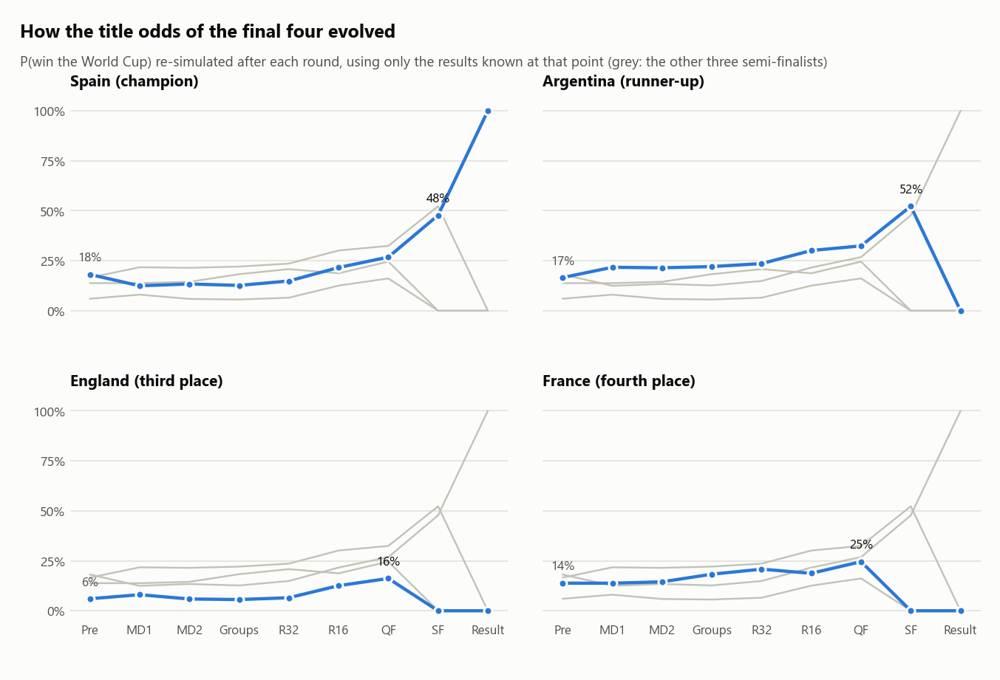
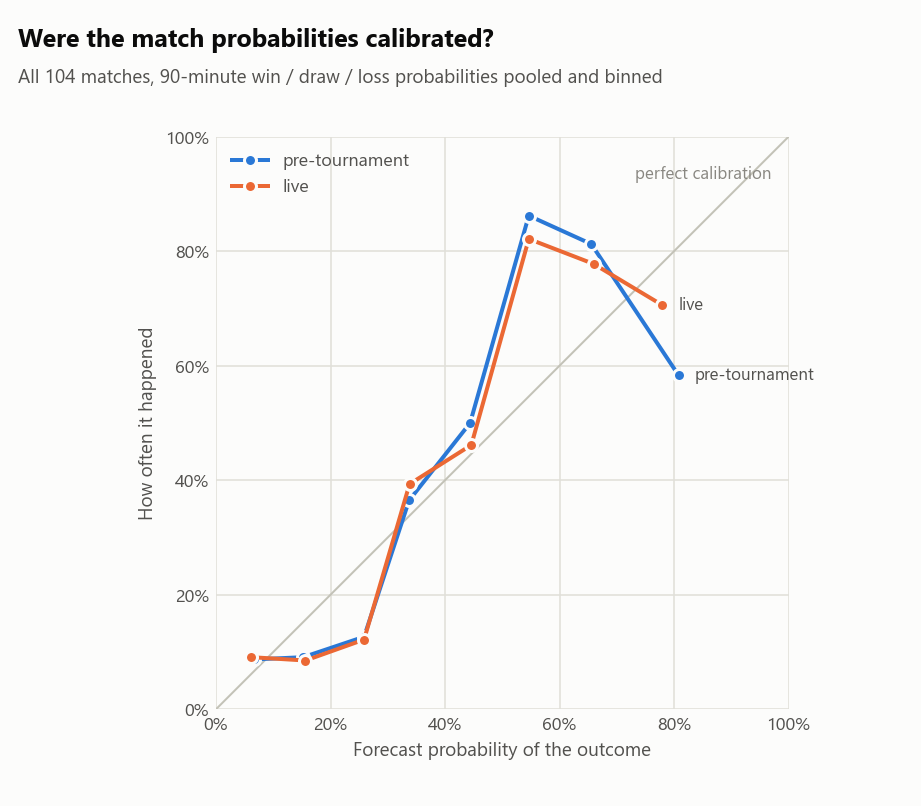

# World Cup 2026: predicted vs actual

_The final evaluation of this forecasting pipeline: every forecast it made, scored against all 104 matches of the 2026 FIFA World Cup (11 June to 19 July 2026). Generated by `run_pipeline.py`; every number below is reproducible from the repository._

**Spain are world champions**, beating Argentina 1-0 after extra time in the final. England beat France 6-4 for third place.

## The verdict

| Question | Answer |
|---|---|
| Pre-tournament favourite | **Spain, 18.1%**, the eventual champions |
| Knockout bracket (the model's single most-likely path) | all 4 semi-finalists, both semi-final pairings, the final (Spain v Argentina), the champion and the third-place play-off (England over France) |
| 90-minute results called, all 104 matches | **65.4%** (always backing the first-named team: 49.0%) |
| Knockout winners called | **27 of 32**; 3 of the 5 misses were penalty shoot-outs |
| Group winners · round-of-32 qualifiers called | **10 of 12** · **26 of 32** |
| Probability quality: RPS over all 104 matches (lower is better) | **0.160** vs 0.216 for a no-skill forecast |
| Best model on probability quality | **GB squad-value hybrid** (RPS 0.1535), ahead of Poisson + Elo but within noise (95% CI of the difference -0.0167 to +0.0041) |
| Did re-fitting on tournament results help? | **No**: the live model scored RPS 0.1637 vs 0.1598 for the frozen pre-tournament model (within noise) |

Unless stated otherwise, "the model" is the pre-tournament forecast: trained only on matches played before kick-off and never updated. RPS is the ranked probability score, the standard accuracy measure for win/draw/loss forecasts.

## 1 · The favourites vs reality

<picture>
  <source media="(prefers-color-scheme: dark)" srcset="title_odds_dark.png">
  
</picture>

The model's three favourites were Spain (18.1%), Argentina (16.6%) and France (13.8%); they finished first, second and fourth. England (5th favourite, 6.0%) finished third. Among the other top-eight favourites, Brazil (4th), Portugal (6th) and Colombia (8th) went out in the round of 16 and Germany (7th) went out in the round of 32.

| # | Team | Elo | P(R16) | P(QF) | P(SF) | P(final) | P(title) | Actual finish |
|---:|---|---:|---:|---:|---:|---:|---:|---|
| 1 | Spain | 2215 | 73.5% | 54.0% | 40.8% | 28.0% | 18.1% | Champion |
| 2 | Argentina | 2187 | 69.5% | 55.8% | 40.2% | 26.5% | 16.6% | Runner-up |
| 3 | France | 2122 | 75.5% | 53.7% | 37.3% | 22.5% | 13.8% | Fourth place |
| 4 | Brazil | 2068 | 67.1% | 43.0% | 27.0% | 14.5% | 7.8% | Round of 16 |
| 5 | England | 2085 | 64.0% | 39.7% | 22.6% | 12.0% | 6.0% | Third place |
| 6 | Portugal | 2041 | 63.2% | 39.1% | 22.1% | 12.0% | 6.0% | Round of 16 |
| 7 | Germany | 2003 | 61.6% | 31.9% | 18.4% | 9.3% | 4.3% | Round of 32 |
| 8 | Colombia | 2057 | 55.8% | 31.9% | 16.9% | 8.3% | 3.5% | Round of 16 |
| 9 | Belgium | 1955 | 63.6% | 36.8% | 16.1% | 7.5% | 3.1% | Quarter-final |
| 10 | Netherlands | 2004 | 43.8% | 25.5% | 12.4% | 5.6% | 2.3% | Round of 32 |
| 11 | Morocco | 1984 | 50.3% | 28.2% | 13.5% | 5.7% | 2.3% | Quarter-final |
| 12 | Norway | 1969 | 47.6% | 24.5% | 12.2% | 5.2% | 2.0% | Quarter-final |
| 13 | Ecuador | 2022 | 48.2% | 22.6% | 10.7% | 4.6% | 1.6% | Round of 32 |
| 14 | Switzerland | 1954 | 58.4% | 26.5% | 10.4% | 4.2% | 1.6% | Quarter-final |
| 15 | Croatia | 1965 | 44.3% | 20.8% | 9.7% | 4.1% | 1.5% | Round of 32 |
| 16 | Mexico | 1975 | 57.7% | 26.0% | 10.3% | 3.9% | 1.5% | Round of 16 |

## 2 · Stage by stage

Each stage-reach probability (48 teams × 6 stages) scored against how far every team really went. "Uniform" is the no-skill forecast that gives every team the same chance.

| Stage | Teams | Model's top-N that made it | Avg. probability of those that did | Brier (model) | Brier (uniform) | Skill |
|---|---:|---:|---:|---:|---:|---:|
| Reach round of 32 | 32 | 26 of 32 | 76.9% | 0.1547 | 0.2222 | 30% |
| Reach round of 16 | 16 | 13 of 16 | 56.0% | 0.1196 | 0.2222 | 46% |
| Reach quarter-final | 8 | 5 of 8 | 39.9% | 0.0850 | 0.1389 | 39% |
| Reach semi-final | 4 | 3 of 4 | 35.2% | 0.0425 | 0.0764 | 44% |
| Reach final | 2 | 2 of 2 | 27.2% | 0.0251 | 0.0399 | 37% |
| Win the World Cup | 1 | 1 of 1 | 18.1% | 0.0154 | 0.0204 | 25% |

Every stage beats the uniform forecast (Brier skill 25% to 46%). The "top-N" column ranks teams by probability alone. The bracket path in section 6 also respects who meets whom, which is why it finds 4 of 4 semi-finalists where the probability ranking finds 3.

## 3 · Match predictions: which model was best?

All models are scored on the same 104 matches. Group games use the 90-minute result; knockout ties are scored on their 90-minute result (a tie that went to extra time counts as a draw) and, separately, on who went through. The last column compares each model's per-match RPS with Poisson + Elo (negative = better), with a 95% paired-bootstrap interval: an interval that spans zero means 104 matches cannot separate the two.

| Model | Results called (90 min) | RPS | Group log-loss | Knockout winners | Knockout Brier | Goal MAE | RPS vs Poisson + Elo (95% CI) |
|---|---:|---:|---:|---:|---:|---:|---|
| Base rate (no skill) | 49.0% | 0.2157 | 1.026 | 50.0% | 0.250 | n/a | +0.0560 (+0.0308 to +0.0814) |
| Elo favourite (higher rating wins) | 61.5% | n/a | n/a | 78.1% | n/a | n/a | n/a |
| Poisson (no Elo) | 58.7% | 0.1746 | 0.907 | 75.0% | 0.179 | 0.936 | +0.0149 (+0.0022 to +0.0276) |
| Poisson + Elo | 65.4% | 0.1598 | 0.876 | 84.4% | 0.152 | 0.928 | reference |
| GB squad-value hybrid | 63.5% | 0.1535 | 0.843 | 81.2% | 0.154 | 0.913 | -0.0063 (-0.0167 to +0.0041) |
| Poisson + Elo, live (re-fit daily) | 63.5% | 0.1637 | 0.883 | 84.4% | 0.157 | 0.924 | +0.0040 (-0.0035 to +0.0125) |

- **The Elo feature earns its place.** Without it the Poisson model calls 58.7% of results instead of 65.4%, and its RPS is worse by 0.0149 (95% CI +0.0022 to +0.0276).
- **The GB squad-value hybrid**, the engine behind the Monte-Carlo title odds, produced the best probabilities (RPS 0.1535, group log-loss 0.843) while calling 63.5% of results. Its edge over Poisson + Elo is suggestive rather than conclusive (95% CI -0.0167 to +0.0041).
- **Re-fitting during the tournament did not help.** The live model (the pipeline's own to-date procedure, re-run before each of the 34 match days on the results known by then) scored RPS 0.1637 against 0.1598. It kept pace early and fell behind on matchday 3 and in the knockouts (table below). World-Cup games carry the heaviest Elo weight, so a handful of results moved the ratings further than they deserved; matchday 3 also brings dead rubbers and rotated squads.

| Mean RPS by phase | Matchday 1 | Matchday 2 | Matchday 3 | Knockouts |
|---|---:|---:|---:|---:|
| Poisson (no Elo) | 0.1819 | 0.1515 | 0.1802 | 0.1823 |
| Poisson + Elo | 0.1938 | 0.1405 | 0.1467 | 0.1585 |
| GB squad-value hybrid | 0.1832 | 0.1292 | 0.1429 | 0.1574 |
| Poisson + Elo, live (re-fit daily) | 0.1940 | 0.1396 | 0.1572 | 0.1640 |

## 4 · How the title odds evolved

<picture>
  <source media="(prefers-color-scheme: dark)" srcset="title_timeline_dark.png">
  
</picture>

The full model (GB hybrid, 20,000 simulated tournaments) was re-run after every round using only the results known at that point. Spain started as favourites at 18.1%; after their opening 0-0 against Cape Verde the model moved them to 12.5%, and Argentina became favourites. Argentina were still favourites going into the final (52.3% vs 47.7%). In hindsight the pre-tournament call was the better one.

| Team | Pre-tournament | After matchday 1 | After matchday 2 | After group stage | After round of 32 | After round of 16 | After quarter-finals | After semi-finals | Final result |
|---|---:|---:|---:|---:|---:|---:|---:|---:|---:|
| Spain | 18.1% | 12.5% | 13.4% | 12.7% | 14.9% | 21.6% | 26.8% | 47.7% | 100.0% |
| Argentina | 16.6% | 21.7% | 21.5% | 22.1% | 23.6% | 30.1% | 32.4% | 52.3% | 0.0% |
| England | 6.0% | 8.0% | 5.9% | 5.6% | 6.5% | 12.6% | 16.2% | 0.0% | 0.0% |
| France | 13.8% | 13.8% | 14.5% | 18.3% | 20.8% | 18.7% | 24.6% | 0.0% | 0.0% |
| Brazil | 7.8% | 6.3% | 6.5% | 6.9% | 7.3% | 0.0% | 0.0% | 0.0% | 0.0% |
| Portugal | 6.0% | 3.7% | 4.8% | 3.4% | 4.4% | 0.0% | 0.0% | 0.0% | 0.0% |

## 5 · Group stage

The model named **10 of 12 group winners**, the top two (in either order) in 7 groups and the exact finishing order in 4 (C, F, I and J). It had 26 of the 32 round-of-32 qualifiers. Wrong group winners: Group B went to Switzerland (the model had Canada, and gave Switzerland 45%); Group K went to Colombia (the model had Portugal, and gave Colombia 38%).

Qualifying third-placed teams: DR Congo, Sweden, Ecuador, Ghana, Bosnia and Herzegovina, Algeria, Paraguay and Senegal.

| Group | Predicted order | Actual order | Winner | Positions right | P(actual winner) |
|---|---|---|---|---|---|
| A | Mexico > South Korea > Czech Republic > South Africa | Mexico > South Africa > South Korea > Czech Republic | ✓ | 1 of 4 | 64% |
| B | Canada > Switzerland > Bosnia and Herzegovina > Qatar | Switzerland > Canada > Bosnia and Herzegovina > Qatar | ✗ | 2 of 4 | 45% |
| C | Brazil > Morocco > Scotland > Haiti | Brazil > Morocco > Scotland > Haiti | ✓ | 4 of 4 | 60% |
| D | United States > Paraguay > Australia > Turkey | United States > Australia > Paraguay > Turkey | ✓ | 2 of 4 | 31% |
| E | Germany > Ecuador > Ivory Coast > Curaçao | Germany > Ivory Coast > Ecuador > Curaçao | ✓ | 2 of 4 | 54% |
| F | Netherlands > Japan > Sweden > Tunisia | Netherlands > Japan > Sweden > Tunisia | ✓ | 4 of 4 | 47% |
| G | Belgium > Iran > Egypt > New Zealand | Belgium > Egypt > Iran > New Zealand | ✓ | 2 of 4 | 61% |
| H | Spain > Uruguay > Cape Verde > Saudi Arabia | Spain > Cape Verde > Uruguay > Saudi Arabia | ✓ | 2 of 4 | 78% |
| I | France > Norway > Senegal > Iraq | France > Norway > Senegal > Iraq | ✓ | 4 of 4 | 63% |
| J | Argentina > Austria > Algeria > Jordan | Argentina > Austria > Algeria > Jordan | ✓ | 4 of 4 | 75% |
| K | Portugal > Colombia > Uzbekistan > DR Congo | Colombia > Portugal > DR Congo > Uzbekistan | ✗ | 0 of 4 | 38% |
| L | England > Croatia > Panama > Ghana | England > Croatia > Ghana > Panama | ✓ | 2 of 4 | 61% |

## 6 · The knockout bracket, projected vs actual

The pre-tournament model's single most-likely path through the bracket (modal group finishers, then the likelier side of each tie) against what happened. "Correct" counts the teams that reached each stage, whichever side of the draw they came through.

| Stage | Correct | Projected but missed | Unexpected arrivals |
|---|---|---|---|
| Round of 32 | 26 of 32 | Czech Republic, Iran, Panama, Scotland, South Korea, Uruguay | Australia, Cape Verde, DR Congo, Egypt, Ghana, South Africa |
| Round of 16 | 14 of 16 | Germany, Japan | Brazil, Egypt |
| Quarter-finals | 7 of 8 | Portugal | Switzerland |
| Semi-finals | 4 of 4 | none | none |
| Final | 2 of 2 | none | none |
| Champion | 1 of 1 | none | none |

Tie by tie (each match number compared with its projected counterpart):

| Round | Ties | Fixture right | Winner right |
|---|---:|---:|---:|
| R32 | 16 | 5 of 16 | 9 of 16 |
| R16 | 8 | 2 of 8 | 7 of 8 |
| QF | 4 | 3 of 4 | 4 of 4 |
| SF | 2 | 2 of 2 | 2 of 2 |
| 3rd | 1 | 1 of 1 | 1 of 1 |
| Final | 1 | 1 of 1 | 1 of 1 |

All 32 knockout ties

| Match | Round | Projected | Projected winner | Actual | Score | Winner | Fixture | Winner right |
|---:|---|---|---|---|---|---|---|---|
| 73 | R32 | South Korea v Switzerland | Switzerland | South Africa v Canada | 0-1 | Canada | ✗ | ✗ |
| 74 | R32 | Germany v Scotland | Germany | Germany v Paraguay | 1-1 aet (pens 3-4) | Paraguay | ✗ | ✗ |
| 75 | R32 | Netherlands v Morocco | Morocco | Netherlands v Morocco | 1-1 aet (pens 2-3) | Morocco | ✓ | ✓ |
| 76 | R32 | Brazil v Japan | Japan | Brazil v Japan | 2-1 | Brazil | ✓ | ✗ |
| 77 | R32 | France v Sweden | France | France v Sweden | 3-0 | France | ✓ | ✓ |
| 78 | R32 | Ecuador v Norway | Norway | Ivory Coast v Norway | 1-2 | Norway | ✗ | ✓ |
| 79 | R32 | Mexico v Ivory Coast | Mexico | Mexico v Ecuador | 2-0 | Mexico | ✗ | ✓ |
| 80 | R32 | England v Senegal | England | England v DR Congo | 2-1 | England | ✗ | ✓ |
| 81 | R32 | United States v Bosnia and Herzegovina | United States | United States v Bosnia and Herzegovina | 2-0 | United States | ✓ | ✓ |
| 82 | R32 | Belgium v Czech Republic | Belgium | Belgium v Senegal | 3-2 aet | Belgium | ✗ | ✓ |
| 83 | R32 | Colombia v Croatia | Colombia | Portugal v Croatia | 2-1 | Portugal | ✗ | ✗ |
| 84 | R32 | Spain v Austria | Spain | Spain v Austria | 3-0 | Spain | ✓ | ✓ |
| 85 | R32 | Canada v Algeria | Canada | Switzerland v Algeria | 2-0 | Switzerland | ✗ | ✗ |
| 86 | R32 | Argentina v Uruguay | Argentina | Argentina v Cape Verde | 3-2 aet | Argentina | ✗ | ✓ |
| 87 | R32 | Portugal v Panama | Portugal | Colombia v Ghana | 1-0 | Colombia | ✗ | ✗ |
| 88 | R32 | Paraguay v Iran | Paraguay | Australia v Egypt | 1-1 aet (pens 2-4) | Egypt | ✗ | ✗ |
| 89 | R16 | Germany v France | France | Paraguay v France | 0-1 | France | ✗ | ✓ |
| 90 | R16 | Switzerland v Morocco | Morocco | Canada v Morocco | 0-3 | Morocco | ✗ | ✓ |
| 91 | R16 | Japan v Norway | Norway | Brazil v Norway | 1-2 | Norway | ✗ | ✓ |
| 92 | R16 | Mexico v England | England | Mexico v England | 2-3 | England | ✓ | ✓ |
| 93 | R16 | Colombia v Spain | Spain | Portugal v Spain | 0-1 | Spain | ✗ | ✓ |
| 94 | R16 | United States v Belgium | Belgium | United States v Belgium | 1-4 | Belgium | ✓ | ✓ |
| 95 | R16 | Argentina v Paraguay | Argentina | Argentina v Egypt | 3-2 | Argentina | ✗ | ✓ |
| 96 | R16 | Canada v Portugal | Portugal | Switzerland v Colombia | 0-0 aet (pens 4-3) | Switzerland | ✗ | ✗ |
| 97 | QF | France v Morocco | France | France v Morocco | 2-0 | France | ✓ | ✓ |
| 98 | QF | Spain v Belgium | Spain | Spain v Belgium | 2-1 | Spain | ✓ | ✓ |
| 99 | QF | Norway v England | England | Norway v England | 1-2 aet | England | ✓ | ✓ |
| 100 | QF | Argentina v Portugal | Argentina | Argentina v Switzerland | 3-1 aet | Argentina | ✗ | ✓ |
| 101 | SF | France v Spain | Spain | France v Spain | 0-2 | Spain | ✓ | ✓ |
| 102 | SF | England v Argentina | Argentina | England v Argentina | 1-2 | Argentina | ✓ | ✓ |
| 103 | 3rd | France v England | England | France v England | 4-6 | England | ✓ | ✓ |
| 104 | Final | Spain v Argentina | Spain | Spain v Argentina | 1-0 aet | Spain | ✓ | ✓ |

## 7 · The biggest surprises

The results the model found least likely. Group games: the probability it gave the actual 90-minute outcome. Knockout ties: the probability it gave the team that went through, for every tie it called wrong.

**Group stage**

| Date | Match | Result | What happened | Model's probability |
|---|---|---|---|---:|
| 2026-06-13 | Qatar v Switzerland | 1-1 | draw | 9.4% |
| 2026-06-15 | Spain v Cape Verde | 0-0 | draw | 9.9% |
| 2026-06-24 | South Africa v South Korea | 1-0 | South Africa win | 16.8% |
| 2026-06-23 | England v Ghana | 0-0 | draw | 18.1% |
| 2026-06-14 | Ivory Coast v Ecuador | 1-0 | Ivory Coast win | 18.3% |
| 2026-06-20 | Ecuador v Curaçao | 0-0 | draw | 20.3% |

**Knockouts**

| Date | Match | Result | What happened | Model's probability |
|---|---|---|---|---:|
| 2026-07-07 | Switzerland v Colombia | 0-0 aet (pens 4-3) | Switzerland went through | 39.1% |
| 2026-06-30 | Mexico v Ecuador | 2-0 | Mexico went through | 40.5% |
| 2026-07-03 | Australia v Egypt | 1-1 aet (pens 2-4) | Egypt went through | 40.5% |
| 2026-06-29 | Germany v Paraguay | 1-1 aet (pens 3-4) | Paraguay went through | 42.5% |
| 2026-06-29 | Brazil v Japan | 2-1 | Brazil went through | 49.0% |

4 of the 6 biggest group-stage shocks were draws against a clear favourite. In the knockouts nothing was a real upset by the model's reckoning: the least likely team to go through still had 39%, and 3 of its 5 wrong calls were settled on penalties.

## 8 · Calibration

<picture>
  <source media="(prefers-color-scheme: dark)" srcset="calibration_dark.png">
  
</picture>

Draws were forecast almost exactly as often as they happened (28.4% forecast, 27.9% observed). The miss sits in the favourite/underdog split: outcomes given 50–70% happened 84% of the time (forecast 59%), and outcomes given 10–30% happened 11% of the time (forecast 22%). The model was too cautious about clear favourites. The top bin (over 70%) holds too few forecasts to read much into.

| Forecast bin | n (pre-tournament) | forecast (pre-tournament) | observed (pre-tournament) | n (live) | forecast (live) | observed (live) |
|---|---:|---:|---:|---:|---:|---:|
| 0–10% | 23 | 7% | 9% | 22 | 6% | 9% |
| 10–20% | 44 | 15% | 9% | 47 | 16% | 9% |
| 20–30% | 79 | 26% | 13% | 74 | 26% | 12% |
| 30–40% | 85 | 34% | 36% | 89 | 34% | 39% |
| 40–50% | 24 | 44% | 50% | 26 | 45% | 46% |
| 50–60% | 29 | 55% | 86% | 28 | 55% | 82% |
| 60–70% | 16 | 66% | 81% | 9 | 66% | 78% |
| 70–100% | 12 | 81% | 58% | 17 | 78% | 71% |

## 9 · Who beat the model, who fell short

"Expected stages" adds up a team's six stage-reach probabilities (0 = out in the group, 6 = champion); the difference is how many rounds further, or shorter, it went than the model expected.

**Beat the model**

| Team | Expected stages | Reached | Difference | Finish |
|---|---:|---:|---:|---|
| Spain | 3.14 | 6 | +2.86 | Champion |
| Argentina | 3.06 | 5 | +1.94 | Runner-up |
| England | 2.41 | 4 | +1.59 | Third place |
| Norway | 1.76 | 3 | +1.24 | Quarter-final |
| Morocco | 1.87 | 3 | +1.13 | Quarter-final |
| Switzerland | 1.94 | 3 | +1.06 | Quarter-final |
| France | 3.00 | 4 | +1.00 | Fourth place |
| Egypt | 1.00 | 2 | +1.00 | Round of 16 |

**Fell short**

| Team | Expected stages | Reached | Difference | Finish |
|---|---:|---:|---:|---|
| Uruguay | 1.55 | 0 | -1.55 | Group stage |
| South Korea | 1.30 | 0 | -1.30 | Group stage |
| Czech Republic | 1.22 | 0 | -1.22 | Group stage |
| Germany | 2.21 | 1 | -1.21 | Round of 32 |
| Iran | 1.21 | 0 | -1.21 | Group stage |
| Turkey | 1.20 | 0 | -1.20 | Group stage |
| Scotland | 1.01 | 0 | -1.01 | Group stage |
| Netherlands | 1.80 | 1 | -0.80 | Round of 32 |

## Method and caveats

- **Results.** All 104 scores, including extra time and shoot-outs, were cross-checked against Wikipedia's match reports, ESPN's scoreboards and the martj42 international-results dataset, with no discrepancies. Rebuilding the bracket from the group results alone (FIFA 2026 tie-breakers, the best-third ranking and FIFA's 495-row slot table) reproduces every knockout fixture; the pipeline re-checks this on every run.
- **Pre-tournament model.** Elo and a Poisson goals model trained on internationals up to 2026-06-06 (the historical data is cut at kick-off, so no 2026 score can leak in); the GB hybrid adds squad market values frozen as of 2026-06-10. 20,000 simulated tournaments per forecast, seeded, so reruns reproduce every number exactly.
- **Faithfulness to the forecasts made in June.** The per-match (Poisson + Elo) predictions are bit-for-bit the ones the pipeline produced during the tournament. The Monte-Carlo title odds also depend on the squad-value snapshot. The runs made during the tournament read a live snapshot that has since been rebuilt, so their odds can differ from the numbers here by a few tenths of a point. The one run whose output survives (11 July) had the same final four, final and champion.
- **Knockout scoring.** A tie that went to extra time or penalties counts as a 90-minute draw. Who went through is scored separately, with the model's full advancement probability (extra time at the same scoring rate, then an Elo-tilted shoot-out). Goal errors for extra-time games use 4/3 of the 90-minute expectation.
- **Sample size.** 104 matches is a small sample. Differences of a few thousandths of RPS between models are within noise, which is why the comparison reports bootstrap intervals.

The tables behind this report are the CSV files in this folder.
